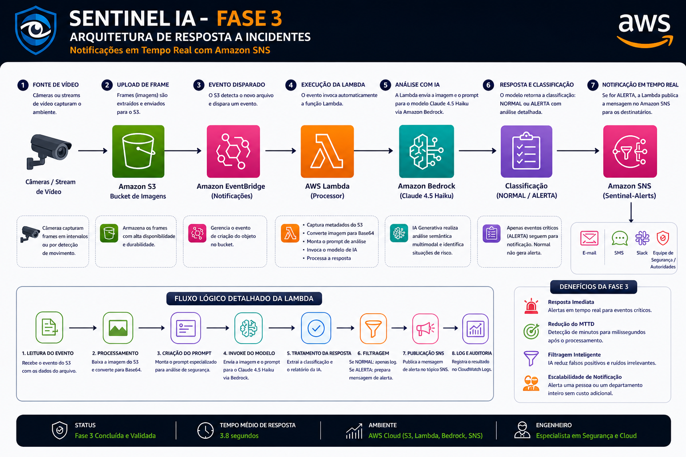
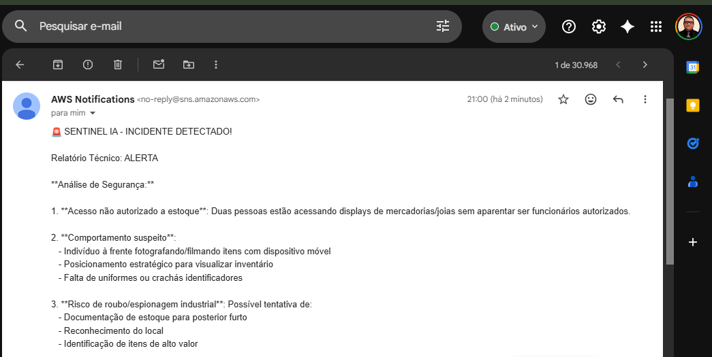
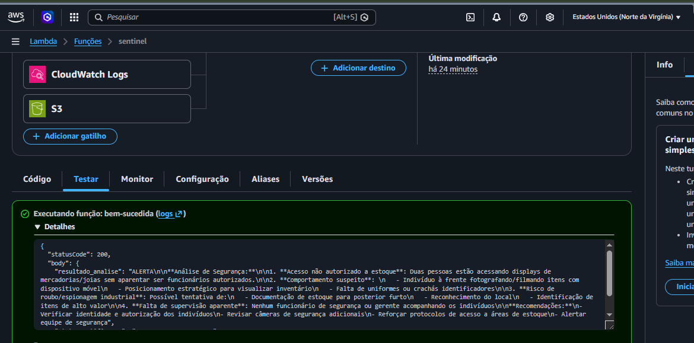
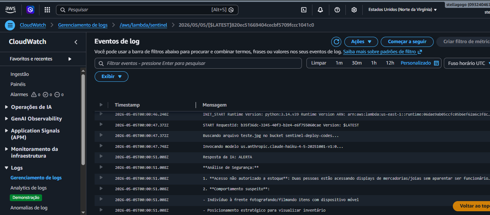
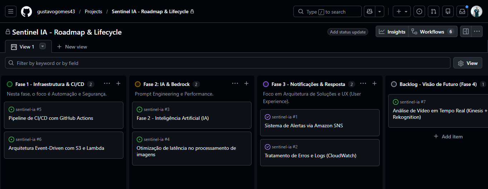

# 🛡️ Sentinel IA — Vigilância Inteligente com IA Generativa (AIOps)

## ⚡ Introdução (Impacto imediato)

E se o seu sistema de segurança **não substituísse pessoas**, mas **direcionasse a atenção delas para o que realmente importa, no momento certo**?

O **Sentinel IA** foi projetado com um objetivo claro:

👉 **IA como suporte à decisão humana — não substituição.**

Enquanto operadores se perdem monitorando dezenas de câmeras, o Sentinel IA atua como um **assistente inteligente**, analisando automaticamente imagens e enviando alertas **diretos, rápidos e acionáveis**.

---

# 🎯 Problema de Negócio

Empresas enfrentam desafios reais em monitoramento:

* 👁️ Sobrecarga de operadores
* ⚠️ Incidentes ignorados ou percebidos tarde
* 🕒 Tempo de resposta elevado
* 💰 Alto custo operacional
* 📉 Baixa eficiência na triagem

---

# 💡 Solução Proposta

O **Sentinel IA** automatiza a análise visual e direciona alertas para quem realmente precisa agir.

## 🧠 Papel da IA no Projeto

O sistema foi desenhado para **trabalhar junto com humanos**:

* 🔔 Alerta o operador responsável
* 📍 Indica o setor/local da ocorrência
* 🚶‍♂️ Direciona a equipe mais próxima
* 🚔 Pode escalar para autoridades

👉 O humano continua no controle — agora com vantagem estratégica

---

# 🎥 Captura de Imagens (Arquitetura Real)

## 🔍 Estratégia adotada: **Snapshot de Vídeo (Frames)**

O sistema **não analisa vídeo diretamente**.
Ele extrai imagens do vídeo em intervalos estratégicos.

## ⚙️ Como funciona

1. Câmeras transmitem vídeo (RTSP/RTMP)
2. Um serviço extrai frames (ex: a cada 2 segundos)
3. Frames são enviados para o S3
4. Pipeline do Sentinel IA realiza a análise

## 🧩 Tecnologias envolvidas

* FFmpeg — captura de frames
* Amazon Kinesis Video Streams — ingestão de vídeo
* Amazon S3 — armazenamento
* AWS Lambda — processamento

## 🎯 Por que essa abordagem?

* 💰 Redução de custo (sem processar vídeo inteiro)
* ⚡ Baixa latência
* 📈 Alta escalabilidade
* 🔧 Simplicidade de integração

👉 **Melhor custo-benefício para sistemas reais**

---

# 🏗️ Arquitetura Geral

Fluxo completo:

1. 🎥 Vídeo capturado
2. 🖼️ Frame extraído
3. 📥 Upload no S3
4. ⚡ Lambda acionada
5. 🧠 IA analisa imagem
6. 📊 Resultado registrado
7. 🔔 (Fase 3) Alerta enviado

---

# 🧠 Tecnologias Utilizadas

| Tecnologia       | Função                   |
| ---------------- | ------------------------ |
| AWS Lambda       | Processamento serverless |
| Amazon S3        | Armazenamento            |
| Amazon Bedrock   | IA generativa            |
| Claude 3/4 Haiku | Análise multimodal       |
| CloudWatch       | Logs                     |
| IAM              | Segurança                |
| Python (Boto3)   | Integração               |

---

# 💰 Custos e Viabilidade

* Modelo sob demanda
* Sem infraestrutura fixa
* Baixo custo inicial
* Escalável

👉 Ideal para MVP e produção

---

# 🚀 FASE 1 — Automação com IA

---

**💡 Explicação do Fluxo (Fase 1 — Sentinel IA**

Este diagrama representa o núcleo do Sentinel IA na sua Fase 1, onde o sistema atua como um **orquestrador inteligente de infraestrutura**, transformando linguagem natural em código pronto para uso.

O fluxo inicia com um evento JSON contendo a solicitação do usuário (ex: criação de recursos cloud). A função **AWS Lambda** recebe esse input e atua como o cérebro operacional da arquitetura, sendo responsável por orquestrar todo o processo.

Em seguida, a Lambda realiza a chamada ao **Amazon Bedrock**, utilizando o modelo Claude 4.5 Haiku para interpretar o prompt e gerar automaticamente código Terraform (IaC), seguindo boas práticas de infraestrutura.

O artefato gerado é então armazenado no **Amazon S3**, com versionamento habilitado, garantindo controle de versões, rastreabilidade e governança dos arquivos produzidos.

Toda a comunicação entre os serviços é protegida por políticas do **AWS Identity and Access Management**, aplicando o princípio de menor privilégio para garantir segurança na execução.

---

👉 **Visão Técnica:**
A arquitetura utiliza um modelo **serverless e orientado a eventos**, eliminando a necessidade de provisionamento manual e permitindo execução sob demanda, com alta escalabilidade e baixo acoplamento.

---

👉 **Valor de Negócio:**
O Sentinel IA, nesta fase, resolve um problema crítico das empresas:

* Reduz o tempo de criação de infraestrutura
* Diminui erros operacionais
* Padroniza ambientes
* Aumenta produtividade de equipes técnicas

Em vez de engenheiros gastarem tempo escrevendo código repetitivo, o sistema permite que foquem em decisões estratégicas.

---

👉 **Resumo Estratégico:**
A Fase 1 valida que é possível utilizar IA generativa como um **acelerador de engenharia**, transformando intenção em entrega real de infraestrutura de forma rápida, segura e escalável.

---

## 📸 Evidências Explicadas

🗂️ Mostra os objetos armazenados no bucket S3 após a execução da Lambda.

👉 Aqui validamos que o sistema conseguiu persistir arquivos gerados automaticamente pela IA, comprovando o fluxo completo de geração → armazenamento.

---

⚙️ Visão geral da função Lambda no console AWS.

👉 Demonstra a configuração principal da função, incluindo runtime, permissões e status — evidenciando que o serviço está operacional.

---

✅ Resultado de um teste manual executado na Lambda.

👉 Confirma que a função está funcionando corretamente e retornando resposta sem erros.

---

📊 Logs gerados pela execução da Lambda no CloudWatch.

👉 Aqui é possível ver o comportamento interno da função, incluindo chamadas para IA e execução do código, essencial para debugging e observabilidade.

---

🧠 Código-fonte da função Lambda em Python.

👉 Mostra a lógica implementada: integração com Bedrock, manipulação de dados e envio para o S3.

---

🔐 Permissões IAM associadas à Lambda.

👉 Demonstra aplicação do princípio de menor privilégio, garantindo segurança no acesso aos serviços AWS.

---

🤖 Teste do modelo Claude no ambiente do Bedrock.

👉 Valida que o modelo de IA está acessível e respondendo corretamente antes da integração com a Lambda.

---

📥 Evento JSON usado para testar a Lambda.

👉 Simula a entrada de dados que a função receberá em produção.

---

📤 Resultado retornado pela execução da Lambda.

👉 Confirma que o sistema conseguiu processar a entrada e gerar saída estruturada corretamente.

---

🧾 Código Terraform gerado automaticamente pela IA.

👉 Este é o principal resultado da Fase 1: Infraestrutura como Código criada via IA, pronta para deploy..

---

🗃️ Configuração de versionamento no S3.

👉 Garante governança e rastreabilidade dos arquivos gerados — essencial para ambientes corporativos.

---

## 📌 Conclusão Fase 1

📑 Conclusão Final do Projeto: Sentinel IA (Fase 1)

O projeto **Sentinel IA** atingiu com sucesso o seu objetivo de **Mínimo Produto Viável (MVP)**. A solução desenvolvida prova que é possível unir Inteligência Artificial Generativa com governança em nuvem para acelerar o ciclo de vida de operações (AIOps).

### 1. Resultados Alcançados
*   **Eficiência Operacional:** Redução do tempo de escrita de arquivos Terraform de minutos para segundos, com garantia de sintaxe correta.
*   **Segurança Nativa:** A integração via Amazon Bedrock permitiu que a IA gerasse códigos já alinhados com as melhores práticas da AWS (Criptografia e Bloqueio de Acesso Público).
*   **Conformidade (Compliance):** O uso de versionamento no S3 e políticas de privilégio mínimo no IAM garante que a automação seja auditável e segura.

### 2. Lições Aprendidas
Durante o desenvolvimento, superamos desafios críticos de **Identity and Access Management (IAM)** e subscrição de modelos no **AWS Marketplace**. A arquitetura final demonstra que o papel do Engenheiro DevOps moderno está evoluindo de "escritor de código" para "orquestrador de sistemas inteligentes".

### 3. Visão de Futuro
Com a base (Fase 1) concluída, o projeto está pronto para evoluir para uma **Esteira de Automação Total (Fase 2)**, onde o código gerado poderá ser validado automaticamente por ferramentas de segurança (Checkov/Terrascan) e implantado via CI/CD sem intervenção manual.

---

**Status do Projeto:** 🟢 Concluído e Documentado.  
**Ambiente:** Produção (AWS US-East-1).

---

# 👁️ FASE 2 — Análise Inteligente

## 📸 Evidências Explicadas

Aqui está o comentário técnico + visão de negócio adaptado para a **Fase 2 do Sentinel IA**:

---

**💡 Explicação do Fluxo (Fase 2 — Sentinel IA | Visão Computacional com IA Generativa)**

🏗️ Diagrama completo da arquitetura da Fase 2.

👉 Apresenta o fluxo end-to-end do sistema, desde o upload da imagem até a análise via IA e registro dos logs.

Este diagrama representa a evolução do Sentinel IA para um sistema capaz de **interpretar imagens e apoiar decisões de segurança em tempo real**, mantendo o humano no centro da operação.

O fluxo inicia com o upload de uma imagem no **Amazon S3**, que atua como ponto de entrada dos dados. Esse evento é automaticamente capturado pelo **Amazon EventBridge**, responsável por disparar a execução de forma desacoplada e orientada a eventos.

A função **AWS Lambda** entra como o componente central de processamento, realizando:

* Captura dos metadados do evento
* Conversão da imagem para Base64
* Construção de um prompt especializado em análise de segurança

Em seguida, a Lambda invoca o **Amazon Bedrock**, utilizando o modelo Claude 3 Haiku para executar uma **análise semântica da imagem**, classificando o cenário como **ALERTA ou NORMAL**.

O resultado é então registrado no **Amazon CloudWatch**, garantindo rastreabilidade, auditoria e observabilidade do sistema.

---

👉 **Visão Técnica:**
A arquitetura segue um modelo **serverless e event-driven**, com processamento assíncrono e altamente escalável, capaz de reagir automaticamente a novos eventos sem necessidade de intervenção manual.

---

👉 **Papel da IA no Sistema:**
A IA não substitui o profissional de segurança.

Ela atua como um **filtro inteligente**, que:

* Destaca eventos relevantes
* Reduz ruído operacional
* Direciona a atenção humana para o que realmente importa

---

👉 **Valor de Negócio:**
Essa abordagem resolve um dos maiores gargalos das operações de monitoramento:

* Reduz a sobrecarga dos operadores
* Diminui falhas humanas
* Acelera o tempo de resposta a incidentes
* Permite escalar a operação sem aumentar proporcionalmente o custo

Na prática, o sistema permite que:

* Alertas cheguem diretamente ao operador responsável
* A equipe de segurança seja acionada com base no local do evento
* Ocorrências possam ser rapidamente escaladas para autoridades, quando necessário

---

👉 **Resumo Estratégico:**
A Fase 2 transforma o Sentinel IA em um **assistente inteligente de vigilância**, capaz de analisar cenários visuais em segundos e **apoiar decisões humanas com mais velocidade, precisão e eficiência operacional**.

---

📊 Logs da execução da análise de imagem.

👉 Mostra o resultado real da IA classificando eventos como ALERTA ou NORMAL, comprovando a inteligência do sistema.

---

🔄 Fluxo interno detalhado da função Lambda.

👉 Explica o pipeline técnico:

- Captura do evento S3
- Conversão da imagem
- Criação do prompt
- Chamada ao Bedrock
- Tratamento da resposta

---

🧠 Código da Lambda responsável pela análise das imagens.

👉 Mostra a implementação prática da integração com IA generativa, incluindo:

- Processamento Base64
- Prompt Engineering
- Interpretação da resposta

---

## 📈 Resultados

* ⏱️ ~3.8s por análise
* 🎯 Alta precisão
* ⚡ Tempo real

---

## 📌 Conclusão Fase 2

Aqui está a **Conclusão da Fase 2** seguindo exatamente o mesmo nível, estrutura e linguagem — mas adaptada ao contexto de visão computacional e valor de negócio do Sentinel IA:

---

📑 **Conclusão Final do Projeto: Sentinel IA (Fase 2)**

O projeto **Sentinel IA** avançou com sucesso para a sua camada de **inteligência analítica**, evoluindo de um sistema automatizado para um **assistente inteligente de segurança baseado em IA generativa**.

A Fase 2 valida, na prática, que é possível transformar dados visuais em **insights acionáveis em tempo real**, apoiando decisões humanas e aumentando a eficiência operacional em ambientes de monitoramento.

---

### 1. Resultados Alcançados

* **Análise Inteligente em Tempo Real:** Implementação de visão computacional com IA generativa via Amazon Bedrock, permitindo classificar imagens como **ALERTA ou NORMAL** em poucos segundos (~3.8s).

* **Arquitetura Event-Driven:** Integração entre Amazon S3, Amazon EventBridge e AWS Lambda, garantindo processamento automático, escalável e sem intervenção manual.

* **Eficiência Operacional:** Redução significativa da sobrecarga de monitoramento humano, permitindo que operadores foquem apenas em eventos relevantes, ao invés de vigilância contínua passiva.

* **Observabilidade e Auditoria:** Registro completo das execuções no Amazon CloudWatch, garantindo rastreabilidade e controle das análises realizadas.

---

### 2. Lições Aprendidas

Durante o desenvolvimento desta fase, foram superados desafios importantes relacionados a:

* Processamento e conversão de imagens (Base64) para integração com IA
* Engenharia de prompt (Prompt Engineering) para obter respostas objetivas e acionáveis
* Ajuste de performance e timeout em funções serverless
* Orquestração eficiente de eventos em arquiteturas desacopladas

A principal evolução foi compreender que o valor não está apenas na tecnologia, mas na **capacidade de traduzir dados em decisões rápidas e úteis para o negócio**.

---

### 3. Visão de Futuro

Com o “cérebro” do sistema validado, o Sentinel IA está pronto para evoluir para a **Fase 3 — Resposta a Incidentes**, onde a análise deixará de ser apenas informativa e passará a ser **acionável em tempo real**.

Os próximos passos incluem:

* Integração com notificações via Amazon SNS
* Envio de alertas direcionados para operadores e equipes de segurança
* Possibilidade de escalonamento para autoridades em casos críticos
* Fechamento do ciclo completo: **Detecção → Análise → Ação**

---

👉 **Resumo Estratégico:**
A Fase 2 consolida o Sentinel IA como um sistema capaz de **entender cenários visuais e apoiar decisões humanas com velocidade, precisão e escalabilidade**, reduzindo custos operacionais e aumentando a eficiência das equipes de segurança.

---

**Status do Projeto:** 🟢 Fase 2 Concluída e Validada
**Ambiente:** AWS Cloud (S3, Lambda, Bedrock, EventBridge, CloudWatch)

---

# 🚨 Sentinel IA — Fase 3: Resposta a Incidentes em Tempo Real

## 🧠 Visão Geral

A Fase 3 marca a conclusão do Sentinel IA como um sistema completo de vigilância inteligente.

O projeto evolui de um modelo de análise para um sistema **ativo**, capaz de:

- Detectar ameaças
- Analisar contexto com IA
- **Notificar imediatamente os responsáveis**

👉 O foco não é substituir humanos, mas **acelerar decisões críticas**.

---

## 🏗️ Arquitetura da Fase 3

Este diagrama representa o fluxo completo da análise até a resposta. A principal evolução em relação à Fase 2 é a adição da **camada de notificação (SNS)**, que transforma o sistema em um agente ativo de segurança.

---

## ⚙️ Execução da Lambda e Integração com Serviços

Aqui vemos a função Lambda como ponto central da arquitetura.  
Ela orquestra:

- Leitura do S3
- Comunicação com IA (Bedrock)
- Registro no CloudWatch
- (Fase 3) Publicação no SNS

👉 Isso demonstra um padrão clássico de **orquestração serverless desacoplada**.

---

## 🧠 Código da Inteligência (Processamento + IA)

Este trecho evidencia o coração do sistema:

- Conversão da imagem para Base64
- Construção do prompt especializado
- Chamada ao modelo Claude via Bedrock

👉 Destaque importante:
A IA não retorna texto genérico — ela foi treinada via prompt para retornar **decisões objetivas (ALERTA/NORMAL)**, reduzindo ambiguidade operacional.

---

## 📊 Logs e Resultado da Análise

Aqui está a prova real de funcionamento:

- A imagem é processada
- A IA analisa o contexto
- O sistema retorna: **RESULTADO FINAL: ALERTA**

👉 Valor crítico:
Isso comprova que o sistema não apenas executa, mas **toma decisão automatizada baseada em contexto**.

---

## ⚙️ Como Funciona

1. 📸 Frames são capturados a partir de vídeo (câmeras)
2. 📥 Enviados para o Amazon S3
3. ⚡ Evento dispara AWS Lambda
4. 🧠 IA (Bedrock) analisa a imagem
5. 📊 Classificação:
   - NORMAL
   - ALERTA
6. 🚨 Se ALERTA:
   - Publicação no Amazon SNS
   - Notificação enviada em tempo real

---

## 🚀 O que isso resolve na operação (Visão para Negócio)

### ⏱️ MTTD (Mean Time to Detect)
Redução do tempo de detecção de minutos para **milissegundos após processamento**.

---

### 🔇 Filtragem de Ruído
A IA evita falsos positivos:
- Ignora sombras
- Ignora animais
- Foca apenas em risco real

👉 Menos ruído = mais eficiência operacional

---

### 📡 Escalabilidade de Notificação
O sistema pode:
- Alertar 1 pessoa
- Alertar 1 equipe inteira
- Escalar para autoridades

👉 Sem aumento de infraestrutura

---

## 🔧 Implementação

### 1. Amazon SNS
- Criação do tópico: `Sentinel-Alerts`
- Configuração de subscrição (e-mail)

---

### 2. IAM
Permissões ajustadas para Lambda:

- S3 (leitura)
- Bedrock (inferência)
- SNS (publicação)

---

### 3. IA (Bedrock)
- Modelo: Claude 4.5 Haiku
- Uso de Inference Profiles (cross-region)

---

## 📊 Resultados Técnicos

- ⏱️ Tempo médio: ~3.8s
- 🧠 Análise multimodal avançada
- 🚨 Alertas em tempo real
- 📈 Alta escalabilidade

---

## ⚠️ Desafios Superados

- NoSuchKey (eventos S3)
- ValidationException (Bedrock)
- Parsing de JSON (StreamingBody)

---

## 🧾 Conclusão Final

O Sentinel IA agora é um sistema completo:

👉 Detecção  
👉 Análise  
👉 Ação  

---

## 🧠 Resultados de Negócio

- ↓ Tempo de resposta
- ↓ Custos operacionais
- ↑ Eficiência da equipe
- ↑ Segurança

---

## 🔮 Próximos Passos

- Integração com Slack / Teams / PagerDuty
- Automação via IoT (sirenes, portas)
- Dashboard em tempo real (SOC)

---

## 👨‍💻 Nota do Engenheiro

O Sentinel IA deixou de ser um projeto técnico e se tornou uma solução real de negócio.

Hoje ele:

👉 Enxerga  
👉 Entende  
👉 Age  

---

## 📌 Status

🟢 Operacional  
🚀 Pronto para demonstração

---

## 🧾 Conclusão Estratégica — Por que o Sentinel IA importa

O **Sentinel IA** demonstra, de forma prática, como a combinação de **arquitetura serverless + IA generativa** pode transformar operações tradicionais em sistemas inteligentes, escaláveis e orientados à ação.

Mais do que um projeto técnico, trata-se de uma **solução de eficiência operacional**.

---

### 💼 Valor direto para empresas

Em um cenário onde tempo e custo são críticos, o Sentinel IA entrega:

- ⏱️ **Redução do tempo de resposta**  
  Incidentes deixam de ser percebidos tardiamente e passam a ser tratados em tempo real.

- 💰 **Otimização de custos operacionais**  
  Menos necessidade de monitoramento constante e manual.

- 📈 **Escalabilidade sem aumento proporcional de custo**  
  A mesma estrutura atende pequenas operações ou ambientes corporativos complexos.

- 🎯 **Tomada de decisão mais assertiva**  
  A IA elimina ruído e destaca apenas o que realmente importa.

---

### 🧠 Diferencial competitivo

Empresas que adotam esse tipo de solução saem de um modelo:

- Reativo → **Proativo**  
- Manual → **Automatizado**  
- Operacional → **Estratégico**

---

### 🚀 Visão de futuro

O Sentinel IA não é apenas um projeto finalizado — ele é uma base pronta para evolução:

- Integração com múltiplos canais (Slack, Teams, APIs)
- Automação física (IoT)
- Centros de comando inteligentes (SOC)

---

### 🎯 Mensagem final

> O verdadeiro valor não está em detectar eventos…  
> Está em **agir no momento certo, com a informação certa**.

E é exatamente isso que o Sentinel IA entrega.

## 🗺️ Roadmap de Desenvolvimento e Gestão
Para uma visão detalhada de como este projeto foi planejado e executado, acesse o nosso quadro de gestão. Lá você encontrará a documentação de desafios técnicos de cada fase e a visão de futuro do produto.

> [!TIP]
> **[Clique aqui para acessar o Roadmap do Sentinel IA](https://github.com/users/gustavogomes43/projects/1/views/1)**

### 🛠️ Ciclo de Vida do Projeto:

- **Fase 1 (Concluída):** Infraestrutura Serverless e Automação de Deploy (CI/CD).
- **Fase 2 (Concluída):** Inteligência Artificial Generativa com Bedrock e Claude 3.
- **Fase 3 (Concluída):** Notificações Críticas e Filtragem de Alertas via SNS.
- **Fase 4 (Backlog):** Análise de vídeo em tempo real com Rekognition Video.
