# 🛡️ Sentinel IA — Vigilância Inteligente com IA Generativa (AIOps)

## ⚡ Introdução (Impacto imediato)

E se o seu sistema de segurança **não substituísse pessoas**, mas **direcionasse a atenção delas para o que realmente importa, no momento certo**?

O **Sentinel IA** foi projetado com um objetivo claro:

👉 **IA como suporte à decisão humana — não substituição.**

Enquanto operadores se perdem monitorando dezenas de câmeras, o Sentinel IA atua como um **assistente inteligente**, analisando automaticamente imagens e enviando alertas **diretos, rápidos e acionáveis**.

---

# 🎯 Problema de Negócio

Empresas enfrentam desafios reais em monitoramento:

* 👁️ Sobrecarga de operadores
* ⚠️ Incidentes ignorados ou percebidos tarde
* 🕒 Tempo de resposta elevado
* 💰 Alto custo operacional
* 📉 Baixa eficiência na triagem

---

# 💡 Solução Proposta

O **Sentinel IA** automatiza a análise visual e direciona alertas para quem realmente precisa agir.

## 🧠 Papel da IA no Projeto

O sistema foi desenhado para **trabalhar junto com humanos**:

* 🔔 Alerta o operador responsável
* 📍 Indica o setor/local da ocorrência
* 🚶‍♂️ Direciona a equipe mais próxima
* 🚔 Pode escalar para autoridades

👉 O humano continua no controle — agora com vantagem estratégica

---

# 🎥 Captura de Imagens (Arquitetura Real)

## 🔍 Estratégia adotada: **Snapshot de Vídeo (Frames)**

O sistema **não analisa vídeo diretamente**.
Ele extrai imagens do vídeo em intervalos estratégicos.

## ⚙️ Como funciona

1. Câmeras transmitem vídeo (RTSP/RTMP)
2. Um serviço extrai frames (ex: a cada 2 segundos)
3. Frames são enviados para o S3
4. Pipeline do Sentinel IA realiza a análise

## 🧩 Tecnologias envolvidas

* FFmpeg — captura de frames
* Amazon Kinesis Video Streams — ingestão de vídeo
* Amazon S3 — armazenamento
* AWS Lambda — processamento

## 🎯 Por que essa abordagem?

* 💰 Redução de custo (sem processar vídeo inteiro)
* ⚡ Baixa latência
* 📈 Alta escalabilidade
* 🔧 Simplicidade de integração

👉 **Melhor custo-benefício para sistemas reais**

---

# 🏗️ Arquitetura Geral

Fluxo completo:

1. 🎥 Vídeo capturado
2. 🖼️ Frame extraído
3. 📥 Upload no S3
4. ⚡ Lambda acionada
5. 🧠 IA analisa imagem
6. 📊 Resultado registrado
7. 🔔 (Fase 3) Alerta enviado

---

# 🧠 Tecnologias Utilizadas

| Tecnologia       | Função                   |
| ---------------- | ------------------------ |
| AWS Lambda       | Processamento serverless |
| Amazon S3        | Armazenamento            |
| Amazon Bedrock   | IA generativa            |
| Claude 3/4 Haiku | Análise multimodal       |
| CloudWatch       | Logs                     |
| IAM              | Segurança                |
| Python (Boto3)   | Integração               |

---

# 💰 Custos e Viabilidade

* Modelo sob demanda
* Sem infraestrutura fixa
* Baixo custo inicial
* Escalável

👉 Ideal para MVP e produção

---

# 🚀 FASE 1 — Automação com IA

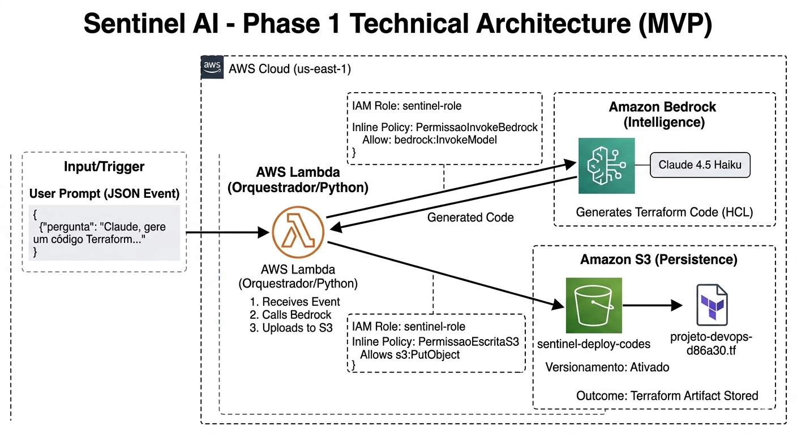

---

**💡 Explicação do Fluxo (Fase 1 — Sentinel IA**

Este diagrama representa o núcleo do Sentinel IA na sua Fase 1, onde o sistema atua como um **orquestrador inteligente de infraestrutura**, transformando linguagem natural em código pronto para uso.

O fluxo inicia com um evento JSON contendo a solicitação do usuário (ex: criação de recursos cloud). A função **AWS Lambda** recebe esse input e atua como o cérebro operacional da arquitetura, sendo responsável por orquestrar todo o processo.

Em seguida, a Lambda realiza a chamada ao **Amazon Bedrock**, utilizando o modelo Claude 4.5 Haiku para interpretar o prompt e gerar automaticamente código Terraform (IaC), seguindo boas práticas de infraestrutura.

O artefato gerado é então armazenado no **Amazon S3**, com versionamento habilitado, garantindo controle de versões, rastreabilidade e governança dos arquivos produzidos.

Toda a comunicação entre os serviços é protegida por políticas do **AWS Identity and Access Management**, aplicando o princípio de menor privilégio para garantir segurança na execução.

---

👉 **Visão Técnica:**
A arquitetura utiliza um modelo **serverless e orientado a eventos**, eliminando a necessidade de provisionamento manual e permitindo execução sob demanda, com alta escalabilidade e baixo acoplamento.

---

👉 **Valor de Negócio:**
O Sentinel IA, nesta fase, resolve um problema crítico das empresas:

* Reduz o tempo de criação de infraestrutura
* Diminui erros operacionais
* Padroniza ambientes
* Aumenta produtividade de equipes técnicas

Em vez de engenheiros gastarem tempo escrevendo código repetitivo, o sistema permite que foquem em decisões estratégicas.

---

👉 **Resumo Estratégico:**
A Fase 1 valida que é possível utilizar IA generativa como um **acelerador de engenharia**, transformando intenção em entrega real de infraestrutura de forma rápida, segura e escalável.

---

## 📸 Evidências Explicadas

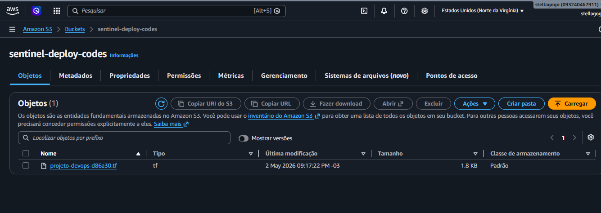

🗂️ Mostra os objetos armazenados no bucket S3 após a execução da Lambda.

👉 Aqui validamos que o sistema conseguiu persistir arquivos gerados automaticamente pela IA, comprovando o fluxo completo de geração → armazenamento.

---

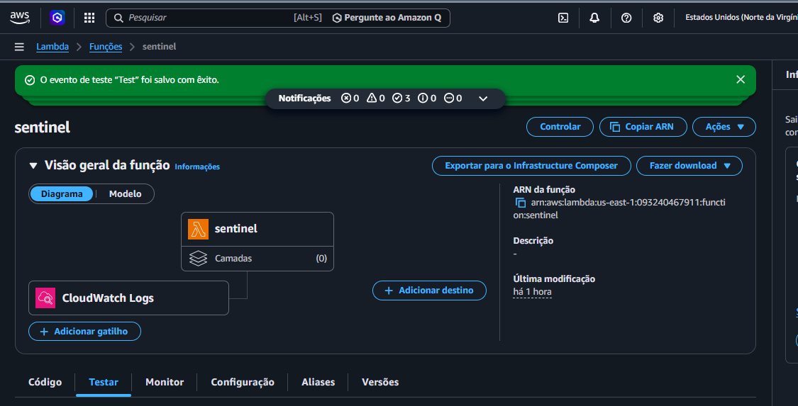

⚙️ Visão geral da função Lambda no console AWS.

👉 Demonstra a configuração principal da função, incluindo runtime, permissões e status — evidenciando que o serviço está operacional.

---

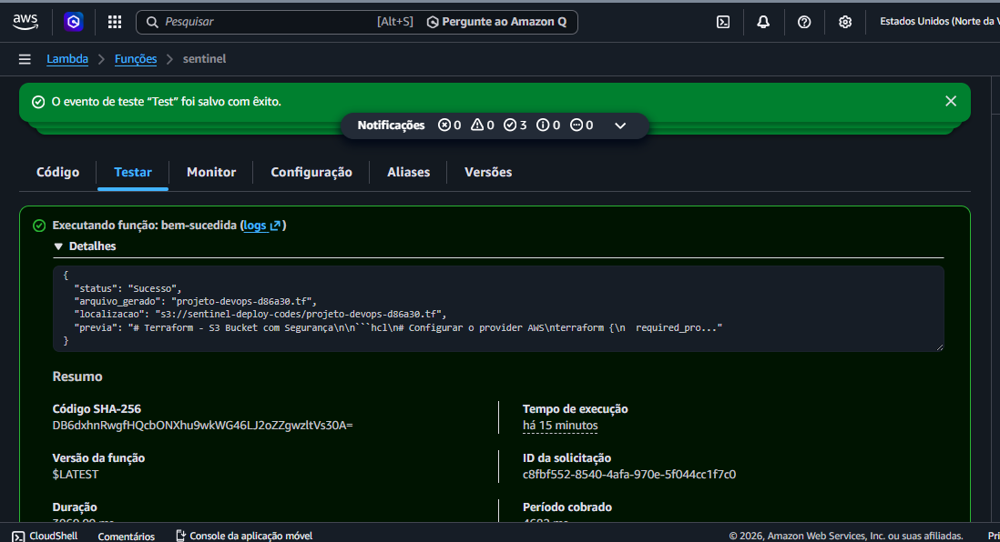

✅ Resultado de um teste manual executado na Lambda.

👉 Confirma que a função está funcionando corretamente e retornando resposta sem erros.

---

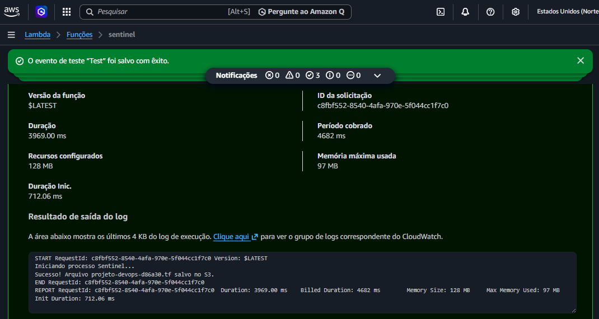

📊 Logs gerados pela execução da Lambda no CloudWatch.

👉 Aqui é possível ver o comportamento interno da função, incluindo chamadas para IA e execução do código, essencial para debugging e observabilidade.

---

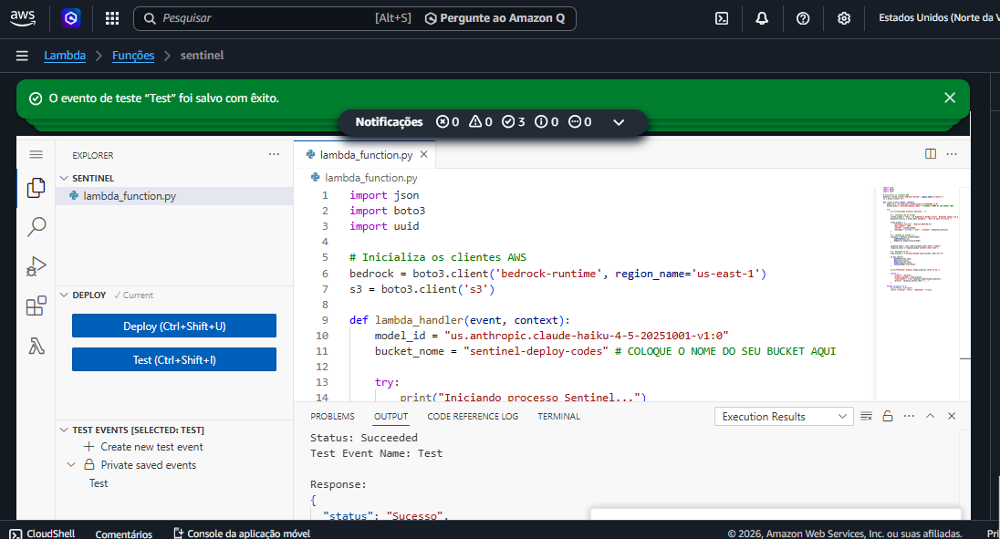

🧠 Código-fonte da função Lambda em Python.

👉 Mostra a lógica implementada: integração com Bedrock, manipulação de dados e envio para o S3.

---

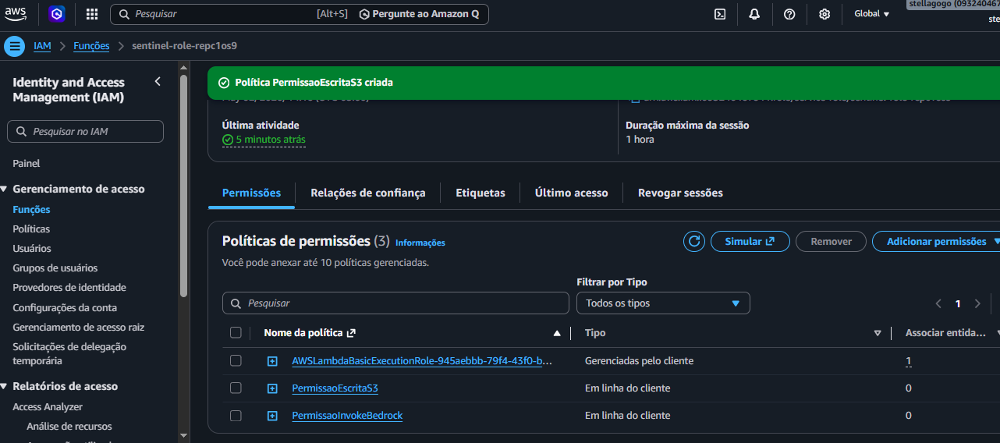

🔐 Permissões IAM associadas à Lambda.

👉 Demonstra aplicação do princípio de menor privilégio, garantindo segurança no acesso aos serviços AWS.

---

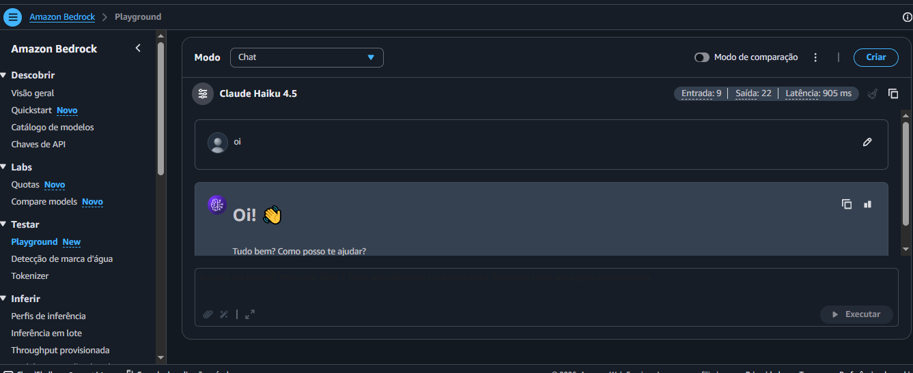

🤖 Teste do modelo Claude no ambiente do Bedrock.

👉 Valida que o modelo de IA está acessível e respondendo corretamente antes da integração com a Lambda.

---

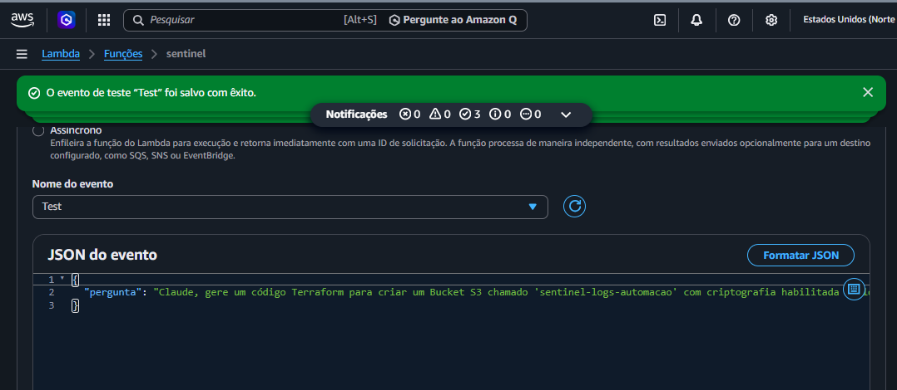

📥 Evento JSON usado para testar a Lambda.

👉 Simula a entrada de dados que a função receberá em produção.

---

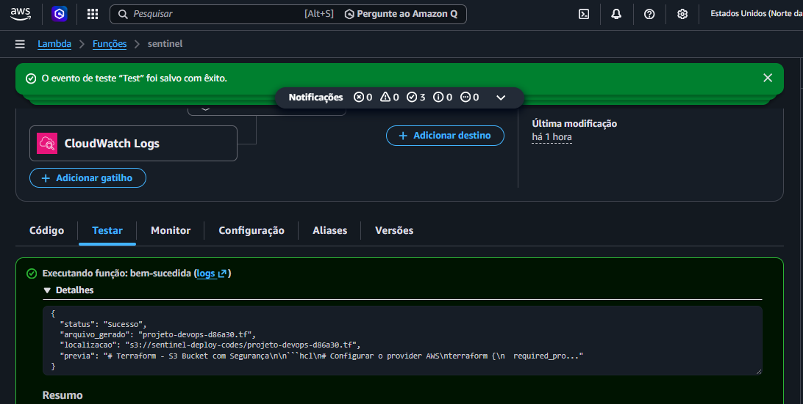

📤 Resultado retornado pela execução da Lambda.

👉 Confirma que o sistema conseguiu processar a entrada e gerar saída estruturada corretamente.

---

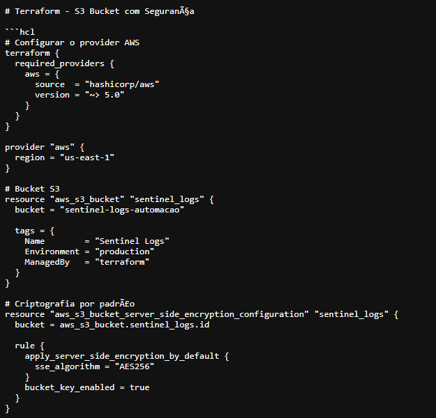

🧾 Código Terraform gerado automaticamente pela IA.

👉 Este é o principal resultado da Fase 1: Infraestrutura como Código criada via IA, pronta para deploy..

---

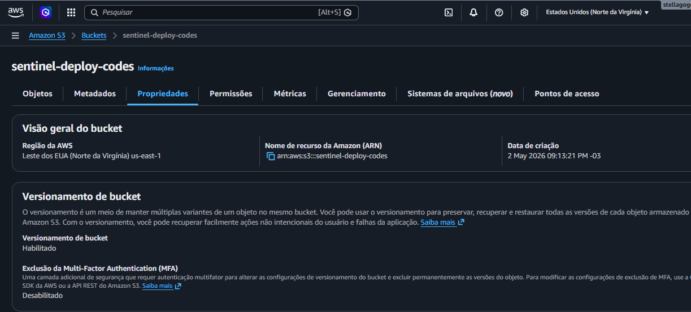

🗃️ Configuração de versionamento no S3.

👉 Garante governança e rastreabilidade dos arquivos gerados — essencial para ambientes corporativos.

---

## 📌 Conclusão Fase 1

Automação de infraestrutura validada com sucesso.

---

# 👁️ FASE 2 — Análise Inteligente

## 📸 Evidências Explicadas

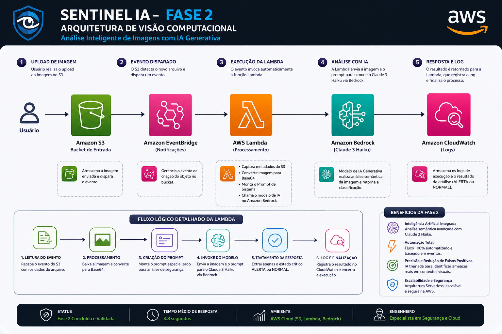

🏗️ Diagrama completo da arquitetura da Fase 2.

👉 Apresenta o fluxo end-to-end do sistema, desde o upload da imagem até a análise via IA e registro dos logs.

---

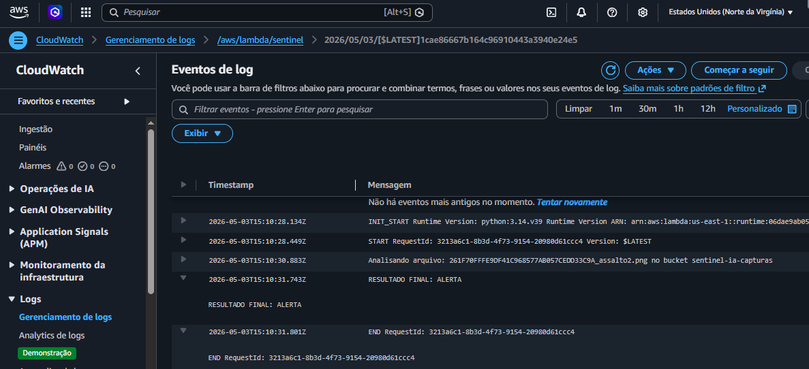

📊 Logs da execução da análise de imagem.

👉 Mostra o resultado real da IA classificando eventos como ALERTA ou NORMAL, comprovando a inteligência do sistema.

---

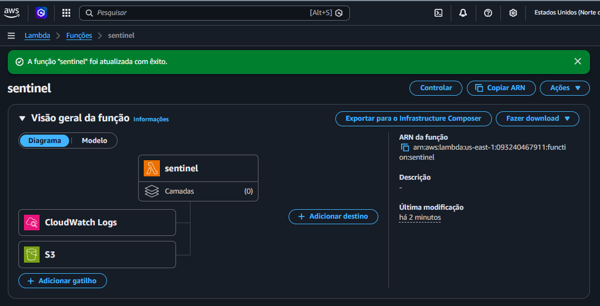

🔄 Fluxo interno detalhado da função Lambda.

👉 Explica o pipeline técnico:

- Captura do evento S3
- Conversão da imagem
- Criação do prompt
- Chamada ao Bedrock
- Tratamento da resposta

---

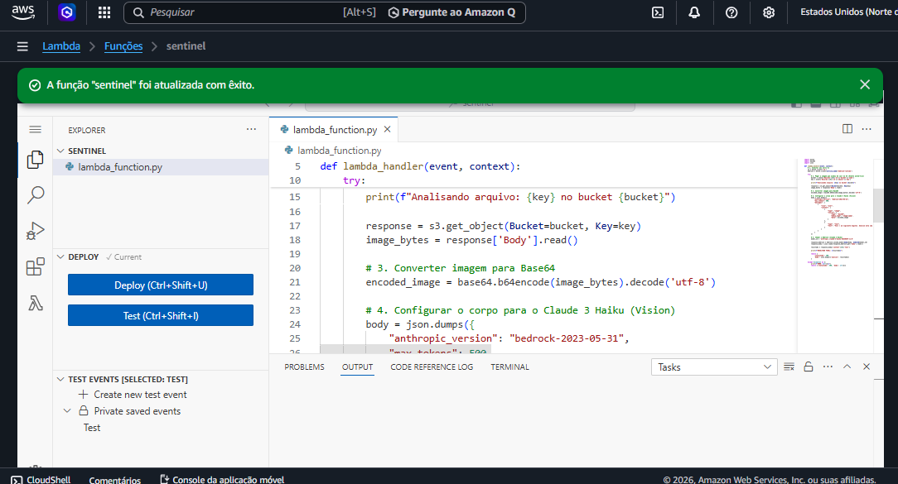

🧠 Código da Lambda responsável pela análise das imagens.

👉 Mostra a implementação prática da integração com IA generativa, incluindo:

- Processamento Base64
- Prompt Engineering
- Interpretação da resposta

---

## 📈 Resultados

* ⏱️ ~3.8s por análise
* 🎯 Alta precisão
* ⚡ Tempo real

---

## 📌 Conclusão Fase 2

O sistema agora **entende o que está acontecendo nas imagens** e apoia decisões humanas.

---

# 🚧 FASE 3 — Resposta a Incidentes

## 🎯 Objetivo

Transformar análise em ação.

## 🔔 Fluxo de alerta

* IA detecta evento
* Sistema identifica local
* Alerta enviado para:

  * Operador
  * Equipe mais próxima
  * Autoridades

---

# 📊 Benefícios para Empresas

* ↓ Sobrecarga operacional
* ↑ Eficiência
* ↑ Segurança
* ↓ Tempo de resposta

---

# ⚠️ Desafios Enfrentados

* Processamento de imagem
* Integração com IA
* IAM
* Arquitetura escalável

---

# 🔮 Melhorias Futuras

* Dashboard em tempo real
* Banco de eventos
* Integração com câmeras ao vivo
* Edge computing

---

# 🧾 Conclusão Final

O Sentinel IA não substitui pessoas.

👉 Ele **potencializa decisões humanas com velocidade e precisão.**

Transforma vigilância em inteligência.

---

# 👨‍💻 Autor

**Gustavo Gomes**

---

# 🚀 Mensagem Final

Foi construido um sistema que:

👉 Observa
👉 Analisa
👉 Alerta

E principalmente…

👉 **Ajuda pessoas a agir no momento certo**

---

**Status:** 🟢 Fase 2 concluída | 🚧 Fase 3 em andamento
**Ambiente:** AWS Cloud + IA Generativa
